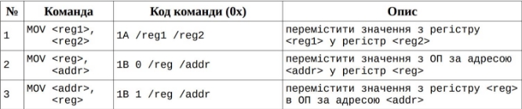
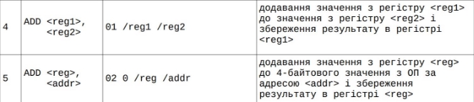
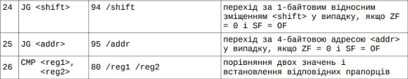

**Національний технічний університет України**
**“Київський політехнічний інститут ім. Ігоря Сікорського”** 
**Факультет прикладної математики**
**Кафедра системного програмування і спеціалізованих комп’ютерних систем** 

**ЛАБОРАТОРНА РОБОТА №2** 

***з дисципліни                “Архітектура комп’ютерів ”*** 

**ТЕМА: “Перетворення віртуальних адрес”** 

**Група: КВ-13** 

**Виконав: Луценко Б. А.**

**Оцінка:** 

**Київ – 2024**

**Мета роботи** 

- ознайомитись із елементами рівня архітектури системи команд;  
- ознайомитись з елементами рівня архітектури операційної системи на прикладі функції реалізації і підтримки віртуальної пам’яті; навчитись перетворювати віртуальні адреси у фізичні. 

**Постановка задачі** 

Завдання лабораторної роботи наступне: реалізувати програму мовою C або C++, що виконує зчитування послідовності команд (програми) з файлу і заміняє віртуальні адреси на фізичні в командах, що визначаються варіантом. Тип організації пам’яті також визначається варіантом. Заміна адреси відбувається у випадку, якщо сторінка та/або сегмент знаходиться в оперативній пам’яті (ОП). Якщо потрібна віртуальна сторінка та/або сегмент відсутні в ОП, тоді має бути виведене повідомлення про помилку відсутності сторінки/сегменту, й аналіз команд має бути продовжено. Таблиця сторінок/сегментів задається у файлі формату CSV. 

**Завдання за варіантом** 







**Тестування програми**


**program.txt** 

```
1A 01 1A 9F 1A FF 

1B 00 00000001 1B 05 1000FF00 1B 05 00070101 1B 10 00C000A1 

1B 15 1000FF00 1B 15 00070101 

01 01 01 9F 01 FF 

02 00 00C000A1 02 05 1000FF00 02 05 00070101 

94 03 94 09 94 0D 

94 0F 94 10 94 1F 94 FF 

95 00C000A1 95 1000FF00 

95 00070101 

80 01 80 9F 80 FF 

1C 10 1234 1C 18 1234 1C 1D 1234 1C 1F 1234 1C 1F 0001 

1C 1F 0100 

```


**analysis.txt** 

```

1A 01 

MOV R1, R0 

1A 9F 

MOV R15, R9 

1A FF 

MOV R15, R15 

1B 00 00 00 00 01 MOV R0, [DD565000] 

1B 05 10 00 FF 00 

Segment does not exist in the descriptor table for segment number 1792 

MOV R5, [0x1000FF00] 

1B 05 00 07 01 01 

Segment does not exist in the descriptor table for segment number 257 MOV R5, [0x00070101] 

1B 10 00 C0 00 A1 

Segment does not exist in the descriptor table for segment number 161 MOV [0x00C000A1], R0 

1B 15 10 00 FF 00 

Segment does not exist in the descriptor table for segment number 1792 

MOV [0x1000FF00], R5 

1B 15 00 07 01 01 

Segment does not exist in the descriptor table for segment number 257 MOV [0x00070101], R5 

01 01 

ADD R1, R0 

01 9F 

ADD R15, R9 

01 FF 

ADD R15, R15 

02 00 00 C0 00 A1 

Segment does not exist in the descriptor table for segment number 161 ADD R0, [0x00C000A1] 

02 05 10 00 FF 00 

Segment does not exist in the descriptor table for segment number 1792 

ADD R5, [0x1000FF00] 

02 05 00 07 01 01 

Segment does not exist in the descriptor table for segment number 257 ADD R5, [0x00070101] 

94 03 JG 3 

94 09 JG 9 

94 0D JG 13 

94 0F JG 15 

94 10 JG 16 94 1F JG 31 

94 FF JG 255 

95 00 C0 00 A1 

Segment does not exist in the descriptor table for segment number 161 JG [0x00C000A1] 

95 10 00 FF 00 

Segment does not exist in the descriptor table for segment number 1792 

JG [0x1000FF00] 

95 00 07 01 01 

Segment does not exist in the descriptor table for segment number 257 JG [0x00070101] 

80 01 

CMP R1, R0 

80 9F 

CMP R15, R9 

80 FF 

CMP R15, R15 

1C 10 12 MOV R0, 18 

1C 18 12 MOV R8, 18 

1C 1D 12 MOV R13, 18 

1C 1F 12 MOV R15, 18 

1C 1F 00 MOV R15, 0 1C 1F 01 MOV R15, 1 

```
